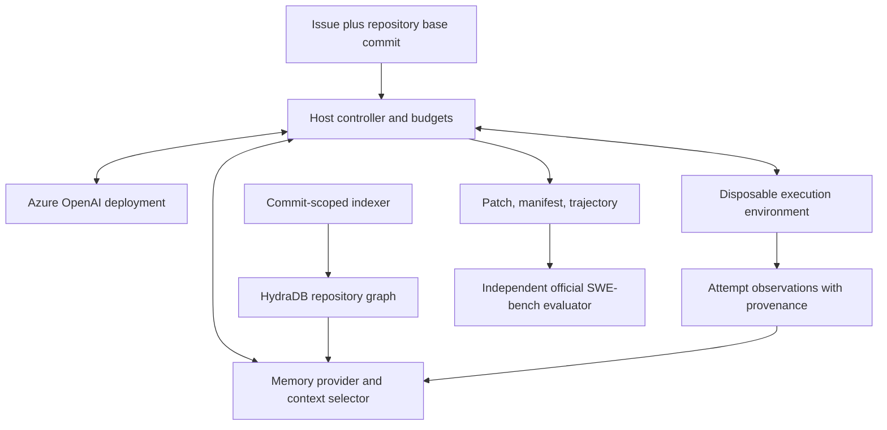

# HydraDB coding agent: design and experimental memo

Date: 2026-09-13. Status: proposed research design; Azure harness and hosted HydraDB ingestion/retrieval implemented and tested offline.

## Decision

Build a small coding agent with Azure OpenAI as the reasoning model, a disposable execution environment, and an interchangeable memory provider. First establish that the harness can reliably inspect code, edit files, run tests, and export patches. Then introduce repository retrieval, graph traversal, and attempt memory as separately measurable interventions.

The research claim is a hypothesis: **at a fixed model and resource budget, a commit-scoped repository graph improves issue resolution or reduces the cost of resolving an issue.** A graph may instead introduce latency, irrelevant neighbors, stale facts, and ingestion expense. The experiment must be capable of finding no benefit.

HydraDB describes a graph database with OpenCypher, Bolt, and HTTP interfaces, while its hosted SDK documentation describes knowledge and memory primitives. These are related but distinct integration surfaces. Select and verify the actual deployment's API before writing its adapter. Website capability statements are not measurements of this coding system. [HydraDB](https://hydradb.com/), [HydraDB SDK introduction](https://docs.hydradb.com/get-started/v2/introduction).

## Scientific basis and limits

SWE-bench frames repository repair as generating a patch from an issue and a codebase, then testing that patch. That makes it an appropriate downstream measure of whether retrieved context helps engineering work. Agent-written summaries and self-reported test success are insufficient evaluation evidence. [SWE-bench paper](https://arxiv.org/abs/2310.06770).

SWE-agent studies how the agent's computer interface affects software engineering performance. Therefore prompts, editor behavior, search tools, output limits, and execution environments must stay fixed when comparing memory systems. Otherwise an improvement cannot be attributed to HydraDB. [SWE-agent paper](https://arxiv.org/abs/2405.15793).

Repository indexing is external knowledge; observations accumulated during an attempt are episodic memory. Standard independent SWE-bench instances can measure repository context and within-attempt memory, but cannot alone establish the value of persistent memory across customer sessions. A separate chronological experiment is needed for that claim. This distinction is our experimental design, not a benchmark guarantee.

## Architecture

The model selects actions; the controller validates arguments, executes tools, records observations, and enforces budgets. SDK tool calling supplies the structured request/result exchange. Model-generated commands still require isolation and validation of the surrounding protocol. [OpenAI function calling](https://developers.openai.com/api/docs/guides/function-calling).

Keep the first agent single-threaded, with one shell tool and an explicit finish tool. Shell provides search, reading, editing, and tests without several overlapping tool abstractions. A future editor or planner is a separately versioned harness change and must be rerun across all experimental arms.

Azure integration uses the official Python `OpenAI` client with an Azure `/openai/v1/` base URL and an API key held by the controller. The request's `model` value is the user's Azure deployment name. Do not infer model identity or capabilities from that name; save the model returned by the service in the trace and record the deployment's actual model version in experiment manifests. The initial implementation uses Chat Completions; deployments requiring another API need a provider adapter. [Microsoft endpoint guide](https://learn.microsoft.com/en-us/azure/foundry-classic/openai/how-to/switching-endpoints).

## Repository graph

“Index the entire repository” means cover the allowed source snapshot, with an explicit exclusion manifest. It does not mean load every file into the model or every historical revision into the graph. Start with Python to align the first parser and test environment with the selected benchmark tasks.

| Entity or edge | Representation and purpose |
| --- | --- |
| RepositorySnapshot | Repository identity, full base SHA, tree hash, parser version, ingestion status |
| File | Relative path, blob hash, language, size, exclusion reason where applicable |
| Symbol | Qualified name, kind, signature, source span, file identity |
| Chunk | Source text or immutable reference, byte/line span, content hash, embedding version |
| CONTAINS / DEFINES | Snapshot to file, file to symbol or chunk |
| IMPORTS / REFERENCES / CALLS | Directed dependencies, extraction method, resolution confidence |
| INHERITS | Class relationships when statically resolvable |
| TESTS | Verified coverage evidence or explicitly labeled inferred association |
| Observation | Attempt, tool call, current workspace revision, evidence, timestamp, verification status |

Use deterministic IDs derived from namespace, repository, commit, path, entity kind, and stable span/signature information. Version every derived artifact. Parse syntax deterministically before adding model-generated summaries. Python's dynamic imports, reflection, decorators, and monkey-patching make a fully correct static call graph impossible in general: unresolved edges remain unresolved, and inferred edges must not appear as facts.

Include source, tests already present at the base commit, documentation, configuration, and dependency manifests. Exclude secrets, binaries, vendored/build output, caches, and oversized files according to a checked-in policy. Record excluded files and extraction failures so coverage is measurable. Handle symlinks, submodules, and Git LFS explicitly; do not silently claim they were indexed.

Build an immutable base graph for each commit. Edits create an attempt-local overlay: reparse changed files, invalidate their old outgoing edges and summaries, and tombstone deletions. A retrieval hit from the base graph must be checked against the current workspace hash before use. Do not merge speculative agent edits into the shared base graph.

## Retrieval and memory policy

Begin with lexical and exact symbol matching. Add embeddings over the same source chunks, then graph expansion from the same candidate seeds. A proposed first graph policy expands one hop through imports, references, definitions, and test associations, with per-edge-type and total-node limits. Tune limits on development instances only.

The selector returns compact evidence packets containing source text, path, span, commit/blob hash, retrieval score, and the relationship path explaining why each item was selected. Deduplicate overlaps and cap the combined context in tokens. Treat every packet as evidence to verify against source. Prefer targeted retrieval after an unsuccessful search or new test failure over blindly injecting a large graph summary at every turn.

Attempt memory records concrete observations: failing command and output, files examined, a rejected hypothesis with evidence, edits, and test results. Separate observations from beliefs and invalidate them after relevant edits. Persist evidence-backed records outside the conversation for recovery and targeted recall; do not store unsupported model conclusions as repository truth.

The `MemoryProvider.search` protocol now has a hosted HydraDB v2 implementation. It ingests allowed files from the execution snapshot, waits for completed graph construction, and retrieves bounded evidence with source IDs and hashes. `NullMemory` exists for the baseline. Explicit symbol/edge extraction and observation-writing APIs remain future work. The current automatic content graph is a preliminary experimental arm; it does not yet implement the separately controlled B–E retrieval policies below.

## Experimental design

| Arm | Available context | Main comparison |
| --- | --- | --- |
| A | Shell search and normal conversation; no external memory | Working agent baseline |
| B | A plus lexical chunk retrieval | Value of indexed retrieval |
| C | B plus embedding retrieval over identical chunks | Value of semantic candidate retrieval |
| D | C plus typed graph expansion and ranking | Incremental value of graph relationships |
| E | D plus attempt-local observation retrieval | Incremental value of episodic memory |

Store B–E on the same selected infrastructure when practical so a D–C comparison changes graph use rather than the database vendor. A storage-engine comparison would be a different experiment. Give retrieval-enabled arms the same search API, evidence format, maximum retrieval calls, and context budget. Charge retrieval and summary model tokens against the shared budget. A–B includes a tool-availability difference by design; C–D should not.

Freeze task IDs, dataset revision, environment images/digests, prompts, tool schemas, Azure deployment/model version, reasoning setting, budgets, and dependency versions before a scored comparison. Use one attempt per task per arm for the primary pass@1 result. On a smaller preregistered subset, repeat with several runs to quantify variability; record any supported seeds but do not assume Azure inference is deterministic. Interleave arms to reduce time and service-load confounding.

Start with a tiny hand-written repair fixture, then a small operational pilot. Choose a development set disjoint from the held-out scoring set, accounting for overlap between benchmark subsets; do not assume Lite and Verified are disjoint. After tuning, freeze the protocol and run the selected SWE-bench Verified evaluation set. A pilot establishes feasibility, not a reliable accuracy uplift.

Primary outcome: fraction of assigned instances resolved by the official evaluator. Report the numerator, denominator, and all infrastructure failures. Publish both end-to-end outcomes counting failures as unsuccessful and a clearly labeled valid-evaluation-only analysis; never silently remove hard tasks. The evaluator applies predictions and runs tests in isolated environments; its expected prediction fields are `instance_id`, `model_name_or_path`, and `model_patch`. [Official evaluation guide](https://www.swebench.com/SWE-bench/guides/evaluation/).

Secondary outcomes: model input/output/cached/reasoning usage where available, tool calls, failed commands, retrieval latency, context bytes/tokens, wall time, ingestion time, and storage. Compute cost per resolved task as total incurred cost divided by resolved tasks, including failed attempts. Report undefined/infinite cost when none resolve. Use actual Azure and HydraDB account rates captured at run time, not assumed public prices. Report cold indexing cost and amortized cost separately, with the reuse count stated.

For each task let d_i be graph-arm success minus control success. Estimate the paired mean difference and a 95% paired bootstrap interval, with repository-cluster sensitivity analysis to expose shared-repository correlation. Use an exact McNemar test on discordant task outcomes for the primary single-run comparison. With repeated attempts, preserve task grouping in resampling and report run variability. Preregister the primary D–C comparison; treat the rest as exploratory or adjust for multiple testing. Set the minimum useful effect and power target before the final run, informed by pilot discordance rates.

Diagnose mechanisms using development-only localization labels: changed-file recall at k, irrelevant-context share, graph hops used, stale-hit rate, and whether the model inspected retrieved files. Gold patch locations can help offline analysis after inference, but must never feed the retrieval system. Include no-edge, shuffled-edge, and no-episodic-memory ablations if D/E improve; these test whether gains arise from useful structure or simply extra text.

## Leakage and reproducibility

Allow only the issue statement and the selected base tree into inference. Keep gold patches, evaluator-added tests, expected test labels, later commits, PR discussions containing solutions, and prior attempts at the same held-out task outside both the agent environment and HydraDB namespace. The benchmark adapter must whitelist input fields rather than forwarding dataset rows. Dependency provisioning happens before network is disabled; inference cannot fetch solutions.

Namespace every query and write by tenant, repository, commit, dataset/experiment, instance, and attempt as appropriate. Base source may be reused across attempts at the same commit; mutable attempt memory may not. Log the snapshot and ingestion manifest used by each query. Automated negative tests must prove that an unrelated tenant, future commit, and prior attempt cannot be retrieved.

Pretraining contamination cannot be eliminated by repository isolation. State that limitation, and later validate transfer on newly collected or private chronological tasks. For persistent-memory studies, preserve time ordering and prevent future issues, patches, and feedback from influencing past tasks.

## Initial implementation and boundaries

Implemented: Azure configuration and provider, shell/finish loop, per-call timeouts, step/context/token admission limits, optional reasoning effort, JSONL traces, disposable Git snapshots, Docker backend, explicitly opted-in local backend, hosted HydraDB ingestion/retrieval, and prediction export. The source checkout is not edited by the harness. Docker receives the source snapshot without the host's credentials, Git history, network, or host mounts.

`--memory hydradb` builds an upload manifest from the same Git archive as the workspace, creates the configured database if missing, ingests batches into a fresh attempt collection, and waits for every source to reach `completed`. Search uses an explicit collection and source-ID allowlist; returned source IDs are checked again locally. The adapter supplies ranked/related source chunks, while omitting raw graph paths whose full provenance has not been validated. A query-time freshness check excludes modified/deleted files; the agent reads and edits current source through shell. It does not re-ingest edits yet. Reusing a snapshot across attempts and verifying server-side graph isolation remain later steps. [HydraDB API contract](https://docs.hydradb.com/api-reference/v2/openapi.json).

This architecture assigns retrieval and memory to HydraDB and execution to the workspace. Operating entirely through the database would additionally require a versioned file-editing and execution service; the existing ingestion/search APIs do not replace repository test execution. The current design avoids treating retrieved snippets as authoritative current files.

Token admission currently uses a conservative byte estimate plus overhead; it can stop early and is not model-specific token counting. Actual service usage is recorded. The wall limit is checked between actions; SDK retries can overrun it, so it is not a hard billing or elapsed-time guarantee. Pin model-specific tokenization and implement a controller deadline before a budget-sensitive campaign. Traces contain repository content and are sensitive artifacts even though the configured Azure key is redacted.

The generic Docker image is for development, not a substitute for SWE-bench's per-instance dependency environment. It must be built separately. Docker runtime and live Azure/HydraDB verification depend on local availability and credentials. The local backend is useful for trusted tests but can access the host even though its workspace is temporary; it is unsuitable for untrusted benchmark runs. Submodules, LFS expansion, campaign scheduling, parser-derived graph construction, automatic context compaction, and official grading remain future work. Indexing has a separate timeout and its cold cost must be reported. Uploaded attempt collections are retained, including partial failures; automatic cleanup is not implemented.

The first milestone is complete when offline tests prove the loop can repair a fixture and produce an applicable patch, and a user-configured Azure deployment completes the same task in Docker. No SWE-bench score or HydraDB improvement is claimed at this stage.
