# CodeWiki agent harness

Current implementation: the controller prepares a repository, runs the documentation
agent, saves the wiki, and evaluates its coverage. The generator discovers topics
from eligible source files; benchmark rubrics are available only to evaluation.

```mermaid
flowchart TB
    CLI["CLI controller<br/>Stages, budgets, repository selection"]

    subgraph INPUTS["1. Prepare and index"]
        PREP["Pinned repository snapshot"]
        CORPUS["Allowed code, build and test sources"]
        HYDRA[("HydraDB source index")]
        PREP --> CORPUS
        CORPUS -->|"Upload and verify status"| HYDRA
    end

    subgraph GENERATE["2. Exploration and documentation agent"]
        PLAN["Survey repository → plan outline → write pages"]
        TOOLS["Tools<br/>memory_search · list_files · read_file · module_notes"]
        LLM["Generator LLM<br/>Reason over retrieved evidence"]
        NOTES[("Survey note<br/>Named modules, evidence, open questions")]
        WIKI["Saved outline and wiki pages<br/>Markdown, citations, diagrams"]
        PLAN -->|"Initial search for every session"| TOOLS
        TOOLS -->|"Results or explicit errors"| LLM
        LLM -->|"More tool calls"| TOOLS
        LLM -.->|"Validated exploration results"| NOTES
        NOTES -->|"Survey note for later sessions"| PLAN
        NOTES -->|"Read saved module notes"| TOOLS
        LLM -->|"finish or final text"| WIKI
        WIKI -->|"Continue with next planned page"| PLAN
    end

    subgraph EVALUATE["3. Evaluate coverage"]
        RUBRIC["Pinned benchmark rubric and judge prompt"]
        JUDGE["Judge LLM<br/>Read wiki through docs_navigator"]
        VALID{"Actual content read<br/>and valid judgment?"}
        SCORE["Combine criterion scores<br/>Published hierarchical weights"]
        RUBRIC --> JUDGE
        JUDGE --> VALID
        VALID -->|"Yes"| SCORE
        VALID -->|"No: bounded retry; otherwise unscored"| JUDGE
    end

    REPORT["Report<br/>Coverage, completion status, usage"]
    STATE[("Saved state<br/>Hashes, checkpoints, traces, usage")]

    CLI --> PREP
    HYDRA -->|"Index ready for generation"| PLAN
    TOOLS <-->|"Scoped search"| HYDRA
    CORPUS -->|"Allowlisted file names and source lines"| TOOLS
    WIKI -->|"Completed wiki"| JUDGE
    SCORE --> REPORT
    CLI -.->|"Stage checkpoints"| STATE
    WIKI -.->|"Page checkpoints"| STATE
    JUDGE -.->|"Judgments and traces"| STATE
    STATE -.->|"Verified resume"| CLI

    classDef control fill:#e0e7ff,stroke:#4338ca,color:#1e1b4b
    classDef model fill:#ede9fe,stroke:#7c3aed,color:#3b0764
    classDef storage fill:#dcfce7,stroke:#15803d,color:#14532d
    classDef guard fill:#fef3c7,stroke:#b45309,color:#78350f
    class CLI,PLAN control
    class LLM,JUDGE model
    class CORPUS,HYDRA,WIKI,STATE,NOTES storage
    class VALID guard
```

- The generator surveys the repository once, then plans the outline and writes each page.
  Each session starts with HydraDB retrieval. The survey names up to six modules for later
  reading; it does not walk those modules in separate sessions. A run writes six pages,
  with ten model steps per session. Token use is recorded and does not stop the run.
- Survey edges are inferred from inspected code, not a verified call graph. The saved
  note is a reading list for the outline and page sessions.
- Exact-query results are cached. Search calls are counted and are not capped.
- The generator can read only allowed sources through its tools. It has no shell
  or arbitrary filesystem access, and cannot read the benchmark rubric.
- Index upload/status requests and criterion judgments support concurrency.
  Repositories, generated pages and retrieval batches currently run sequentially.
- Evaluation uses the three CodeWikiBench paper judges and averages their judgments
  before applying the hierarchy. Any one pinned repository is scored against that
  repository's rubric. The navigation adapter supports literal search hints and
  repeated-content reuse.
- An unsuccessful judge read must be corrected before scoring. Exhausted retries
  remain unscored and block a complete overall score; they are never ordinary zeros.
- Source-link checks validate paths and line ranges. They do not verify every claim
  or render Mermaid diagrams.

Implementation: [controller](../src/hydra_agent/codewiki.py),
[generator](../src/hydra_agent/codewiki_agent.py),
[module exploration](../src/hydra_agent/codewiki_explore.py),
[indexing and retrieval](../src/hydra_agent/codewiki_memory.py),
[evaluation](../src/hydra_agent/codewiki_eval.py),
[navigation](../src/hydra_agent/codewiki_navigation.py).
