# CodeWikiBench with HydraDB

This pipeline turns a pinned code snapshot into a generated wiki, using HydraDB retrieval
and a read-only documentation agent, then grades every published rubric criterion for
the selected repositories. The first/default repository is Chart.js. Run all 22 explicitly.

```sh
./codewiki-benchmark                         # Chart.js, or resume the saved selection
./codewiki-benchmark report                  # Inspect current results without API calls
./codewiki-benchmark --repos graphrag --output runs/codewiki-graphrag
./codewiki-benchmark --repos all --output runs/codewiki-all
```

These commands use `.env` for the existing Azure OpenAI and HydraDB credentials.
The generation model defaults to `AZURE_OPENAI_DEPLOYMENT`. Use `--judge-deployment NAME`
to select a different Azure deployment for evaluation. Otherwise the generator also judges;
results explicitly disclose that source of potential bias. No Docker daemon is required:
the model cannot execute code, run shell commands, or access the host filesystem.

## Stages

```mermaid
flowchart LR
  pinned[Pinned CodeWikiBench record] --> metadata[Repository URL and exact commit]
  pinned --> gold[Evaluator-only reference docs and rubrics]
  metadata --> snapshot[Committed source archive]
  snapshot --> policy[Code, build files, and test code]
  policy --> hydra[HydraDB ingestion and completed-index checks]
  hydra --> retrieve[Required full-question retrieval]
  retrieve --> explore[Source module exploration and dependency queue]
  explore --> notes[Saved module notes and open questions]
  notes --> agent[Read-only documentation agent]
  policy --> agent
  agent --> wiki[Markdown pages, diagrams, source citations]
  wiki --> judge[Published rubric prompt and weighted scoring]
  gold --> judge
  judge --> report[Per-criterion judgments and report]
```



1. **Prepare** downloads the pinned dataset record, keeps only repository metadata in
   the agent task, fetches the exact Git commit, and writes a source archive and manifest.
   Dataset revision: `6d215eb7d50a164e370a9a5703b813f9da345965`.
2. **Index** creates the configured database if it does not exist, waits for readiness,
   and uploads eligible files into a unique collection. Each source ID is tied to the
   repository, commit, run, path, and content hash. The manifest records accepted attempts
   and source status. By default, failed sources receive at most one automatic retry; completed
   sources are not uploaded again. Uploads and status checks use up to four concurrent
   requests in batches of 20 sources; configure this with `--index-workers 1-8`.
   Checkpoints and trace callbacks are serialized. Status scans checkpoint once per scan
   (including partial results on failure), instead of rewriting the entire manifest after
   each batch. All sources must report `completed` before generation.
3. **Generate** runs one repository survey through HydraDB retrieval, then
   plans up to six wiki pages and writes each through a bounded tool loop. The survey
   records candidate modules, evidence and unresolved questions. It does not schedule
   those modules as further sessions. Every survey, planning and writing session starts
   with an enforced HydraDB query. Available tools are `memory_search`, paginated
   `list_files`, source-line `read_file`, saved `module_notes`, and `finish`.
   Files are served from an in-memory allowlist, not arbitrary paths. Retrieved graph
   context is evidence, not a verified call graph. Pages include commit-specific source
   citations and Mermaid diagrams where useful.
4. **Evaluate** loads the published prompt and pure leaf-collection/hierarchical-scoring
   functions from CodeWikiBench commit `5e728fb40492effb54d59041f908dbf9079fe238`.
   Each leaf is judged independently with a `docs_navigator` tool over generated pages.
   Scores must be integer 0 or 1 with reasoning and evidence. Parent scores are weighted
   averages of child scores; the final score weights top-level nodes. This preserves the
   published hierarchy rather than flattening leaf weights.
   The judge must successfully read actual page content before scoring. Redundant singleton
   path wrappers are normalized; unknown paths, empty content and tree placeholders return
   explicit errors with usable content paths. Requests for page metadata include the owning
   page's body. A navigation round with any failed
   read must be corrected before a score is accepted. These errors never become ordinary zeros.
5. **Report** writes Markdown and JSON summaries. No overall score is emitted until all
   assigned rubric leaves have valid judgments. Missing/provider/parser failures are
   not interpreted as passes or ordinary zero scores.

Stages can also be invoked individually:

```sh
./codewiki-benchmark prepare
./codewiki-benchmark index
./codewiki-benchmark generate
./codewiki-benchmark evaluate
./codewiki-benchmark index --index-workers 4
```

Terminal output shows elapsed time, repository/stage boundaries, indexed-source progress,
wiki page progress, model steps and token usage, and judged/reused/unscored criterion counts.
Interactive terminals display an activity spinner with stage elapsed time during API waits.
Repeated indexing polls are summarized at progress milestones or every 30 seconds when polls
continue; full request and response details remain in the JSONL artifacts. The final table
shows each repository's status and available coverage score, followed by the report path.
Index progress includes the remaining processing states. After five minutes without a
new completed source, a warning lists up to five remaining paths and their states;
the warning repeats every five minutes until progress resumes. Concurrency reduces
HTTP and local checkpoint overhead; it does not configure HydraDB's processing workers
or fix queued/failed graph jobs. Repositories are still orchestrated sequentially.

Redirecting output automatically disables animation and colors. Use `--plain` to force this
format in a terminal, for example `./codewiki-benchmark --plain | tee codewiki.log`.
Failures name the stage and artifact location. Ctrl-C records an interrupted run and exits
with status 130 after active work unwinds. Rerun the same command to resume saved artifacts.
Already running processes keep their existing output until relaunched. As with other code
updates, generation's existing code fingerprint check may require a new output directory
if an outline or completed pages were produced by an earlier version.

The same commands resume existing artifacts. A process lock prevents two pipeline instances
from writing the same campaign. Reuse validates the source hashes and remote source readiness.
To resume only one repository in an existing campaign, pass its name with `--repos`, for
example `./codewiki-benchmark --output runs/codewiki-gpt6-claude --repos svelte`.
The saved campaign membership and reports retain all repositories; omitted repositories
are not executed. Adding repositories to an existing campaign still requires a new output
directory. Keep the same generation and judge model flags when resuming generated artifacts.
Upload-attempt counts also survive resumes. If a source exhausts the default two attempts,
rerunning the same command will recheck its status but will not upload it again. To explicitly
allow a third upload for failed/missing sources, add `--index-max-attempts 3` to the command.
This is a total per-source limit, not three new retries on every invocation. Completed and
still-processing sources are not re-uploaded. An additional attempt may still encounter the
same HydraDB processing error; a larger `--index-timeout` does not reset the attempt limit.
Generation settings/code and evaluation input/model changes require a new output directory;
completed pages or judgments cannot silently be mixed between settings. A stopped stage
retains its artifacts and returns nonzero. No remote data is automatically deleted.

Judge adapter `docs_navigator_content_access_v4` audits saved tool traces before reusing
completed judgments, including those produced by earlier adapters. A score without verifiable
page access is preserved under `evaluation/judgments/invalidated/` and re-evaluated. A missing
trace also requires re-evaluation. Successful scores with verified content access are retained.

For the separately saved Svelte paper-panel experiment, `scripts/repair_codewiki_judge_access.py`
replays the old navigator against the original inputs and rejudges affected criteria into a
separate output directory. It preserves the original prompts, model limits and weighted scoring,
records the corrected tool behavior, and paces each model to at most 40 request starts per minute.
The audit validates old calls against their original argument schema as well as checking page
access. The repaired tool supports literal `query`/`search` hints within requested pages and
references earlier complete tool output for repeated content, avoiding duplicate context.
Checkpoint verification checks those references and search matches against the delivered text.
Run it in the original isolated environment:

```sh
uv run --no-project --python 3.12 \
  --with-requirements runs/codewiki-svelte-paper/upstream/requirements.txt \
  --with tiktoken==0.11.0 \
  python scripts/repair_codewiki_judge_access.py --check
```

Omit `--check` to execute or resume the selected repairs. The default destination is
`runs/codewiki-svelte-paper-access-fixed`; the previous wiki, scores, and traces are preserved.
If repair code changes after a stopped run, `--upgrade-adapter` records the version change
and rechecks each completed repair against the original page text and the actual tool messages
delivered to the model. It does not allow input changes or upgrading an active run.

To generate a new Svelte wiki and evaluate it with that same three-judge panel, use
the wrapper instead of the single-judge CLI:

```sh
uv run python scripts/run_codewiki_paper_panel.py \
  --repos svelte --output runs/codewiki-svelte-survey \
  --agent-provider openrouter --agent-model openai/gpt-6-astra \
  --plain
```

It runs prepare/index/generate in the project environment, then runs Gemini 2.5 Flash,
GPT OSS 120B and Kimi K2 in the original pinned evaluation environment. Every rubric leaf
starts fresh for each judge. Completed judgments are reused only within that new panel
run, after content-access verification. The prior wiki and scores are not imported.
Do not pass a judge model. The wrapper fixes the three paper judges, prompts, temperature,
response limits, navigation checks and scoring. The same three judges can score any one pinned
repository. Svelte still has to match the previous paper snapshot. Every other repository
is scored against its own pinned CodeWikiBench rubric. The wrapper requires the saved
`runs/codewiki-svelte-paper` protocol artifacts.

```sh
uv run python scripts/run_codewiki_paper_panel.py \
  --repos json --output runs/codewiki-json-unlimited \
  --agent-provider openrouter --agent-model openai/gpt-6-astra \
  --plain
```

Generation records token use and does not stop for a token, context, or search cap.
Evaluation always uses the three paper judges.

Use positional `evaluate` to resume just the panel, or `--check-panel` to validate an
already generated wiki and exercise the navigator without model calls. Panel results
are saved separately at `<repo>/evaluation-paper-panel/report.md` and `result.json`.

## Inputs and limits

The fixed input policy excludes existing prose/reference documentation, documentation/site
directories, `.github`, fixture/snapshot data, dependency lockfiles, binary/unsupported files,
secret filenames and vendored/generated directories. It includes source comments, build
configuration, type declarations, and eligible test code. Every excluded path has a reason
in `inference/corpus.json`. This is a code-focused documentation experiment; it does not
give the generator the reference documentation used to construct benchmark rubrics.

A run surveys the repository once, writes six pages, and allows ten model steps per
session. Generation records token use and does not stop for a token, context, or search
cap. Indexing waits up to 24 hours. Evaluation always uses the three paper judges, four
workers per model. Each invocation makes real billed model and HydraDB requests.

A truncated or malformed judge answer gets up to two correction turns inside that
judge session, using evidence already retrieved. Truncated answers are never scored.
One valid JSON object inside a Markdown fence is accepted with surrounding prose;
malformed JSON, ambiguous answers, missing evidence and nonbinary scores still require
correction.

```sh
./codewiki-benchmark --repos json --output runs/codewiki-json --plain
# Resume only the paper judges, reusing generated pages:
./codewiki-benchmark evaluate --repos json --output runs/codewiki-json --plain
```

The judge receives explicit content paths and can navigate by JSON keys/indices or
exact page titles. Navigation and response fixes can reuse successful judgments from earlier
adapters when documentation, rubric, judge model and pinned evaluator still match.
Each judgment records its adapter version; `evaluation/result.json` reports version
counts so resumed runs with both adapter versions are identifiable. Errors remain
unscored, with local failure reasons saved in judgment files, traces and terminal logs.

Resume rejects a different model, source, or generator code once an outline or page exists.
HydraDB accepts at most 200 source IDs per HTTP query. Larger corpora use multiple
requests per logical query with the same question and disjoint source allowlists;
results are merged by returned score. This is a client merge, not a global rerank.
One logical query can produce more than one HTTP request. No request drops
the source or collection filters to work around the limit.

## Module exploration

The repository survey is enabled for new generation runs. It inspects the source
inventory, reads entry points, and names modules for later documentation. Those modules
are saved as a reading list. The controller does not start another agent session per module.

Returned evidence must reference allowed files and complete source lines actually delivered
by `read_file` in that session. Symbols must exist in their target source file. These checks
establish provenance, not semantic proof of a call/import relationship; edges remain labeled
as inferred. Raw HydraDB graph paths are not exposed by this implementation.

Invalid exploration artifacts receive field-specific feedback for all detected problems
in one response. Corrections use the remaining session steps; there is no
separate two-correction cutoff. Invalid dependencies are never silently accepted or
repaired with unrelated citations. The prompt lists the allowed relation labels and
the exact source file each dependency must cite.

The validation fix can resume a survey checkpoint from the original traversal implementation
before an outline or pages exist, with the same source, model and settings. It preserves
the completed survey, backs up the original checkpoint, and records the code change. Other
source, settings or code changes still require a new run.

The survey, evidence ranges and named modules are saved in `wiki/exploration/state.json`.
An interrupted survey resumes that same session. The outline and page writers receive the
summary and can read the note with `module_notes`. Open questions are retained; they are
not treated as verified facts. Reports mark the survey `bounded` when questions remain,
and include cited-file counts. `completed` means the survey finished, not that every
repository feature was found. A provider error interrupts generation and retains its checkpoint.

```sh
./codewiki-benchmark --repos svelte --output runs/codewiki-svelte-survey --plain
```

Use a new output directory to compare with an existing wiki: its saved generation
fingerprint prevents mixing old pages with this survey. The commands above
run preparation and indexing for their new campaign; they do not silently reuse another campaign's
index. The survey names up to six modules. Token use is recorded and does not stop the run.

`retrieval-cache.json` stores successful identical-query results and the logical-query counter.
Reservations are saved before network requests, so interrupted/failed requests still count.
Cache hits do not consume another query. The cache is bound to the source manifest, database
and collection, and dirty-source exclusions are part of each cache key. Source batches remain
sequential; caching does not change HydraDB's server-side traversal or processing concurrency.

## Artifacts and interpretation

Under `runs/codewiki/`:

```text
campaign.json, report.md, report.json
Chart.js/
  provenance.json, run.json
  inference/task.json, snapshot.tar, corpus.json
  index-manifest.json, index-events.jsonl
  generation-events.jsonl, generation-usage.json
  retrieval-cache.json
  wiki/outline.json, generation.json, README.md
  wiki/exploration/state.json, README.md
  wiki/pages/*.md, docs_tree.json, structured_docs.json
  evaluation/reference.json, rubrics.json
  evaluation/judgments/*.json, *.jsonl
  evaluation/scored-rubrics.json, result.json
```

This is an **Azure-adapted CodeWikiBench evaluation**, not the unchanged upstream CLI:
it uses the pinned official prompt and scoring functions with our model/tool runner,
strict response validation, bounded retries, checkpoints, and usage tracking. It does not
use upstream's fallback behavior that can assign a positive score to an evaluation error.
Generated `docs_tree.json` and `structured_docs.json` also follow the upstream document
navigation format for external evaluation.

The result is rubric **coverage**, not proof of factual correctness, diagram validity,
graph-edge accuracy, or superiority to a no-graph baseline. Citation checks establish
only that a path/line range exists. Mermaid blocks are not renderer-validated. Model
input/output tokens and traces are recorded; no invented dollar estimate or HydraDB
internal token total is reported. A one-repository run is a pilot, not the 22-repository
benchmark score. Dataset/reference material remains outside the generation tool boundary.

Upstream sources: [dataset](https://huggingface.co/datasets/anhnh2002/codewikibench),
[CodeWikiBench](https://github.com/FSoft-AI4Code/CodeWikiBench).
