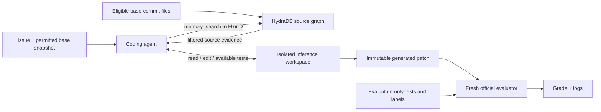

# Evaluating HydraDB repository memory for a sandboxed coding agent

**Protocol version:** 0.2 — mandatory full-task-first retrieval  
**Status:** Proposed experiment; not a results report or a completed preregistration.  
**Primary objective:** Measure whether adding HydraDB repository retrieval improves issue resolution by our Azure-hosted coding agent on SWE-bench.  
**Secondary research objective:** Isolate whether graph relationships contribute beyond comparable non-graph retrieval.

No benchmark score, accuracy improvement, or token/cost reduction is claimed here. Live repository inspection and sandbox smoke tests establish connectivity and execution feasibility, not benchmark performance.

## 1. Research questions and permitted conclusions

We distinguish two experiments because they support different conclusions.

| Experiment | Comparison | Question | Claim it can support |
| --- | --- | --- | --- |
| I: integration effectiveness | A: shell-only agent vs. H: agent with current HydraDB retrieval | Does offering our repository-memory integration improve end-to-end task resolution? | Benefit or harm of the integration as a whole |
| II: graph contribution | C: matched non-graph retrieval vs. D: graph-expanded retrieval | Do graph relationships improve outcomes beyond the same underlying retrieval system? | Incremental contribution of graph expansion under the specified controls |

Experiment I is the immediate implementation target. H combines mandatory initial retrieval, an additional tool, retrieval instructions, service-side processing, and additional evidence. Therefore H beating A would **not** establish that graph structure caused the improvement. Version 0.2 replaces the proposed optional-use H policy before benchmark execution; historical optional-use runs are not pooled into this treatment.

Experiment II is a separately gated study. Its C/D labels correspond to the semantic-retrieval and graph-expansion arms in [design-memo.md](design-memo.md). H is the currently implemented hosted integration, not a claim that the memo's controlled D arm already exists. Lexical-only retrieval and episodic memory remain later ablations.

### Hypotheses

- **I, primary:** H changes the probability of resolving an assigned task relative to A. The null hypothesis is equal resolution probability; the anticipated direction is improvement, but analysis is two-sided and must detect regressions.
- **II, primary:** D changes resolution probability relative to matched C. This hypothesis is evaluated only after the graph-isolation gates below pass.
- **Secondary:** Retrieval may improve localization, reduce unsuccessful shell searches, or lower time/cost per resolved task. These mechanisms are not assumed and need not improve together.

The proposed minimum practically useful accuracy difference is **5 percentage points**, to be accepted or revised before scored runs. Statistical significance and practical usefulness are separate criteria.

## 2. Benchmark population and task selection

Use a pinned revision of `princeton-nlp/SWE-bench_Verified`, whose published test split contains 500 instances. Pin the dataset revision rather than resolving a mutable latest version during a campaign. [Dataset card](https://huggingface.co/datasets/princeton-nlp/SWE-bench_Verified)

Proposed rollout:

1. Select **10 development/pilot instances** using a recorded seed and repository-stratified sampling, without consulting gold patches, grading outcomes, or whether our model solves them. Specify the allocation and deterministic rounding rule in the frozen task manifest.
2. Use one of those ten for the initial end-to-end infrastructure smoke test. Run both arms on the ten-instance operational pilot. These runs are for debugging and budget estimation, not an uplift claim.
3. Freeze the implementation and Experiment I configuration. Use the remaining **490 instances** as the target held-out population if funding and environment coverage permit.
4. If only a smaller held-out campaign is feasible, freeze its IDs and size before inference. Report it as a subset experiment, not a full Verified score. Do not silently remove tasks that fail environment setup.

The first 50 held-out tasks may be an operational checkpoint, but not a point to tune prompts, select a winner, or stop because the score looks favorable. Any outcome-dependent change terminates that confirmatory campaign; subsequent results need a new protocol and an uncontaminated evaluation set.

Experiment II needs its own frozen protocol and task allocation. If it will share this dataset, reserve its held-out allocation **before** examining Experiment I outcomes, or freeze both studies in advance without outcome-driven changes. Reusing observed tasks to tune C/D and then calling them held out is prohibited.

## 3. Experimental unit and controlled conditions

The experimental unit is a **task paired across configurations**. The primary result uses one generated patch per task per arm: operational pass@1, not best-of-N.

Hold these conditions fixed across paired runs:

- Dataset revision, issue text, base commit, eligible source tree, and environment image digest.
- Agent implementation, shared instructions, shell tool, patch export, and context-handling policy.
- Azure endpoint, deployment and observed model identifier, supported reasoning settings, and request parameters. The initial deployment is `grok-4.3`; its mutable deployment name alone is not a model-version guarantee.
- Agent step, context, completion, token, command-time and wall-time limits.
- Evaluator revision, test environment, architecture, and grading policy.

Record the exact prompt/tool differences that enable memory in H. C/D must expose identical tool schemas and evidence formatting; only the preregistered graph-expansion treatment may differ.

Randomize A/H order within task pairs using a fixed scheduling seed and interleave arms. Do not run all A tasks first and H much later. Record timestamps and model/service version changes. If a material backend change occurs, report separate blocks rather than silently pooling them.

No human hints, follow-up chat, or manual repair are allowed during scored inference. Stochastic model behavior is expected; a configured seed, if supported, is not proof of determinism.

## 4. Leakage boundary

The benchmark adapter must construct separate inference and evaluator records through an explicit field allowlist.

| Material | Agent and HydraDB | Isolated evaluator |
| --- | --- | --- |
| Issue statement and files at the selected base commit | Allowed | Allowed |
| Ordinary tests already present at the base commit | Allowed | Allowed |
| Newly written tests produced by the agent | Allowed in its workspace | Present through the exported patch where applicable |
| Gold solution patch and evaluator-added test patch | Forbidden | Allowed |
| Expected test labels, including fail-to-pass/pass-to-pass lists | Forbidden | Allowed |
| Later commits, solution-bearing PR discussions, previous attempt feedback | Forbidden | Not inference inputs |

Build dependencies before inference networking is disabled. The inference image must not contain grader scripts, evaluation patches, solution-bearing logs, or full Git history, including material recoverable from accessible image contents. Reuse official environment definitions, but do not blindly expose an evaluator instance image to the agent.

The host controller retains API credentials. No controller keys, Docker socket, host bind mounts, or outbound networking enter the agent container. Repository source and traces require their own secret-review policy; excluding `.env` filenames is not comprehensive secret detection.

The evaluator runs in a fresh environment after patch generation. Evaluator feedback cannot be fed back into a scored attempt to obtain another patch. A gold-patch evaluator smoke test is permissible only outside inference and outside the model-accessible storage boundary.

Repository isolation cannot eliminate possible model pretraining contamination. State this limitation in any publication and eventually evaluate transfer to fresh/private tasks.

## 5. Role of the graph

The graph supplies **repository evidence**, not patches, test execution, or grades.



For example, an issue involving an omitted argument may require locating a public function, an internal helper, callers, and existing tests. Retrieval could surface those files earlier than shell search. The agent must still reason about the bug and produce a correct patch; irrelevant or stale retrieval could instead hurt performance.

### Current H implementation

- Uses HydraDB's automatic content graph, not a parser-derived, verified call graph.
- Requests `type=knowledge`, hybrid retrieval, `mode=thinking`, graph context, and forceful relations. Freeze the complete request payload.
- Scopes queries to an explicit database, collection, and source-ID allowlist; filters primary and related returned chunks again locally.
- Returns at most 8 evidence chunks, with up to 1,400 bytes of text per chunk plus path, base commit, hash, and retrieval metadata. Raw graph paths are not injected.
- Excludes modified/deleted source paths from new queries. It does not re-index edits or remove old snippets already in conversation.
- Enforces one initial retrieval with the full issue statement before the first model call. In chat, this applies to every user turn. No model-generated keywords, client keyword extraction, or silent query truncation are used for this initial request. The controller records its origin explicitly and delivers the result in the first model context. Follow-up model searches are instructed to use complete natural-language questions or sentences.
- Stops with `memory_error` if initial retrieval fails, reaches the query cap, or cannot query because no unchanged indexed sources remain. A successful empty retrieval may be followed by shell investigation. Internal workspace freshness checks precede the query; model-directed shell investigation does not. Such failures remain in the assigned-task denominator.

Freeze this treatment as `required_full_task_first_v1`. The CLI defaults to HydraDB; A requires explicit `--memory none`. Subsequent source verification remains model-directed. Any optional-retrieval arm is a separately labeled ablation. For C/D, impose the same initial full-task retrieval policy on both arms so retrieval triggering does not confound graph expansion. The synthetic controller-origin tool exchange must not be counted as a model-generated tool call.

### Snapshot reuse

Reuse only an immutable completed index that matches the repository, base commit, source hashes/IDs, and indexing configuration. Verify remote source readiness. Our current `--reuse-index` manifest workflow is adequate for explicit reuse; it is not automatic caching.

The YogaIntelliJ collection is not benchmark context for unrelated tasks. Each SWE-bench source snapshot must be prepared separately. Do not share mutable observations or successful solutions between attempts. Index failures must not silently fall back to the shell-only arm.

## 6. Graph-isolation gates for Experiment II

Simply toggling a field named `graph_context` is not sufficient evidence that only graph expansion changed. Before C/D scoring, verify:

1. Identical source chunks, extraction rules, embeddings, base candidate retrieval, query processing, and pre-expansion candidate limits.
2. Identical final evidence/token limits, source provenance formatting, tool availability, and agent instructions.
3. C genuinely disables graph expansion; D enables a documented, bounded expansion over identified edge types and ranking rules.
4. No extra unmeasured query-rewriting, summarization, or reasoning model distinguishes the arms. If extra processing is necessary for D, account for it and narrow the causal claim accordingly.
5. Returned expansion edges/chunks have valid snapshot provenance and pass cross-collection/future-commit negative tests.

If the hosted API cannot provide or verify these controls, do not label the comparison a pure graph-effect experiment. Implement an explicit controlled retrieval layer or report only the broader integration result. Matched output budgets alone do not establish matched retrieval computation.

Optional later ablations include no-edge and shuffled-edge expansion, equal-volume unrelated evidence, and alternative graph-use policies. Use development data or separately preregister these analyses; do not choose an ablation after inspecting held-out examples and present it as confirmatory.

## 7. Execution protocol

For each assigned task/arm:

1. Validate the pinned task record and environment configuration; create a unique attempt ID.
2. Materialize the clean base snapshot and verify its commit/tree manifest. Start the appropriate non-root inference container and confirm dependencies work without network access.
3. For H, prepare or validate the matching completed index before model inference. Save source coverage and exclusions. For A, perform no HydraDB setup or queries.
4. Execute the agent's non-interactive `run` path with the same issue and frozen limits. In H, the controller first sends the complete issue to HydraDB and supplies the returned evidence before inference; retrieval failures stop the attempt. The agent may then inspect code, write a patch, and run ordinary tests. No interactive assistance is supplied.
5. On normal termination or a handled budget/model stop, export any available patch, its hash, and the trajectory. Freeze it before evaluation. A partial patch is still eligible for grading if extraction succeeded; record its termination reason.
6. Grade the frozen patch with the pinned official evaluator in a fresh instance. Keep evaluation artifacts outside inference-accessible memory.
7. Save the outcome and cleanup status. Resume the campaign from immutable completed records rather than rerunning successful or disappointing attempts.

Prediction rows contain `instance_id`, `model_name_or_path`, and `model_patch`, matching the official format. Use unique evaluator run IDs tied to the campaign, arm, and prediction hash; the official evaluator caches by run ID and instance, so changed patches must not reuse stale grades. [Official evaluation guide](https://www.swebench.com/SWE-bench/guides/evaluation/)

### Retry policy

Predeclare bounded transport retries and provisioning retries. Never retry inference just because the agent produced an empty/incorrect patch. Once model inference starts, a replacement attempt is not silently substituted for pass@1. Ambiguous API failures may incur usage even if no response arrives; log them.

An evaluator infrastructure retry may grade the **same frozen patch** under a recorded bounded policy, without model feedback or patch changes. Preserve original failures and all retry costs. Distinguish campaign resumption from generating an additional model attempt.

## 8. Resource and environment budget

Initial development defaults, subject to a recorded freeze after the pilot:

| Limit | Proposed value |
| --- | ---: |
| Agent steps per task | 40 |
| Agent-model total tokens per task | 200,000 |
| Maximum completion tokens per call | 4,096 |
| Serialized model context admission limit | 200,000 bytes |
| Shell command timeout | 60 seconds |
| Agent wall-time target | 1,200 seconds |
| Index readiness deadline | 900 seconds, separate from inference |
| Retrieval adapter query-call cap | 40, with bounded HTTP retries recorded separately |
| Returned evidence | At most 8 chunks; 1,400 text bytes each |

These are starting limits, not evidence of an optimal configuration. The current context admission estimate is byte-based, not model-tokenizer-based, and SDK retries can extend the present wall limit. Implement a hard controller deadline and explicit retry accounting before claiming strict runtime or billing limits. Fix and document environment resource limits per task; both arms receive the same allocation.

Equal agent-model token budgets do **not** imply equal total compute: HydraDB may use internal models. Experiment I's primary view uses equal agent budgets and reports extra retrieval costs. A total-dollar-budget-matched study is separate and requires observable HydraDB costs and a frozen accounting rule. Missing service usage is marked unknown, never zero.

Prefer native Linux x86-64 campaign workers after verifying compatibility with pinned environments. The current small Colima VM is for development, not assumed adequate for a full campaign. The official guide recommends 16 GB+ RAM and at least 120 GB free disk; actual campaign sizing must follow measured instance requirements. [Docker setup guide](https://www.swebench.com/SWE-bench/guides/docker_setup/)

## 9. Outcomes and failure accounting

### Primary outcome

For task i and arm a, define `Y[i,a] = 1` when the official evaluator reports resolved, otherwise `0` for the assigned-task operational outcome. Missing predictions, setup failures and ungradable attempts count as unsuccessful in this primary denominator; retain their distinct failure categories rather than claiming all are incorrect code.

```text
Resolved rate(a) = sum_i Y[i,a] / number of assigned tasks
Paired uplift(H,A) = mean_i (Y[i,H] - Y[i,A])
```

Report assigned, attempted, generated, graded, resolved, unresolved, empty-patch, setup-error, inference-error, and evaluation-error counts. Agent `submitted`/`model_stopped` statuses are not grades.

A secondary analysis may restrict to pairs with valid grades in both arms. Label this selection-sensitive analysis and report its reduced denominator; it cannot replace the end-to-end result.

### Secondary outcomes

- Agent input/output/cached/reasoning usage where the provider exposes it, without double-counting nested usage fields.
- Model calls, shell calls, failed/timed-out commands, memory-tool calls, actual query requests/retries, and evidence delivered.
- Setup, ingestion, retrieval, inference, grading, and end-to-end latency, separately.
- Available Azure, HydraDB, and execution-infrastructure costs, including failed attempts and retries.
- Cost per resolved task: total incurred campaign cost divided by resolved tasks; undefined when none resolve. Do not present zero as the result.
- Cold indexing cost and observed reused-index cost separately. Any amortized figure must state its reuse count; do not assume a favorable reuse factor.

### Mechanism analyses

Measure returned-file coverage, redundant evidence, subsequent reads of retrieved files, changed-file exclusions, and searches without usable hits. Exact symbol/edge mechanisms require provenance that H currently does not expose.

Gold changed-file locations may be used only in isolated, post-inference analysis. They are an imperfect localization reference because a valid alternative repair can touch different files. Scored-task analysis must not become feedback for later tasks in the same campaign. A comparison of only H runs that chose retrieval is descriptive, not an unbiased treatment-effect estimate.

## 10. Statistical analysis and decision rules

Report paired counts: both resolved, A-only resolved, H-only resolved, neither resolved. Estimate the percentage-point difference and a 95% paired bootstrap interval, resampling whole task pairs. Include repository-cluster sensitivity analysis and per-repository descriptive results; acknowledge uncertainty from a small number of repositories.

Use an exact two-sided McNemar test on discordant pairs for the primary accuracy comparison at alpha 0.05. Its usual task-independence assumption is a limitation when tasks share repositories; interpret it alongside the clustered sensitivity analysis. Secondary metrics and ablations are exploratory unless a separate multiplicity-controlled family is frozen beforehand.

Target 80% power for the agreed practically useful difference. Required paired sample size depends on discordance, not just each arm's accuracy. Estimate plausible discordance ranges from development work and perform a prospective power analysis before fixing the scored sample. Ten pilot tasks provide weak estimates. If the available population cannot support the target power, disclose this rather than promising detection of small gains.

Interpretation:

- A positive result requires a positive estimated effect with uncertainty supporting improvement; statistical significance alone does not establish a useful 5-point gain or acceptable cost.
- A claim that the gain is at least 5 points requires uncertainty supporting that threshold, not merely a point estimate above it.
- If the interval includes zero, report the comparison as inconclusive at that precision; do not claim equivalence.
- If accuracy is worse or cost/time rises disproportionately, report that result. No assumed benefit is a release criterion.

Optional repeated runs must have fixed task IDs and repetition counts before scoring. They measure stochastic variability and are analyzed separately; they do not replace the primary patch with the best repeat.

## 11. Reproducibility artifacts

Each campaign must retain:

- Protocol/config hash; dataset and evaluator revisions; task split and scheduling seed.
- Agent code revision or content digest, dependency lockfile, prompts, tools, model settings and observed identifiers.
- Environment image digests, architecture, source-tree manifests, setup scripts and logs.
- HydraDB database/collection, index configuration, eligible/excluded sources, request IDs, source provenance and graph-mode settings.
- Immutable predictions and patch hashes; model/tool trajectories; actual and estimated usage clearly distinguished.
- Official reports and test logs, failures/retries, cost-rate snapshots where available, and cleanup/retention records.
- Machine-readable per-task results plus a generated Markdown summary containing denominators and uncertainty.

Do not publish API keys, private source, or raw traces without review. Pin provider/service versions where possible; where pinning is unavailable, record the limitation and execution window.

## 12. Implementation gates and acceptance criteria

| Gate | Required evidence |
| --- | --- |
| G1: safe task adapter | Tests prove forbidden dataset fields never reach prompts, the sandbox, or HydraDB |
| G2: reproducible environments | One representative task boots at its base commit with working dependencies and no evaluation material exposed |
| G3: evaluator health | Known solution succeeds in an isolated evaluator smoke; deliberate invalid/empty predictions are reported correctly |
| G4: one end-to-end agent attempt | Agent-generated patch reaches official grading with complete artifacts, whether resolved or not |
| G5: paired operational pilot | All ten pilot tasks in both arms have grades or explicit failure categories, with usage/cost coverage documented |
| G6: experiment freeze | Exact IDs, configuration, retries, resource limits, sample size and analysis script approved before held-out inference |
| G7: graph-specific study | All C/D graph-isolation gates pass and a separate held-out allocation/protocol is frozen |

Existing work supplies the model/tool loop, sandbox, patch export, source indexing, explicit graph reuse and retrieval traces. Still required are the benchmark adapter, clean per-instance environments, official grading integration, campaign resumption, hard resource accounting, and statistical reporting. An attractive chat interface is not a substitute for these gates.

## 13. Pre-launch checklist

- [ ] Freeze dataset revision, pilot/held-out IDs and sampling rules.
- [ ] Freeze agent/evaluator versions, prompts, tools, model settings and image digests.
- [ ] Choose and approve runner resources and monetary limits; document unobservable service costs.
- [ ] Pass leakage, namespace, evaluator-health and environment tests.
- [ ] Complete the pilot, then freeze inference/context/retrieval policy without inspecting held-out results.
- [ ] Freeze retry policy, prospective power analysis, primary denominator and analysis code.
- [ ] Verify that automatic reuse cannot cross commits or import attempt feedback.
- [ ] Establish artifact access, index retention and cleanup policies.
- [ ] Record that Experiment I tests integration effectiveness; do not describe it as isolated proof of graph structure.

Until these fields are populated and the gates pass, this document is a technical design for the experiment, not a claim that the campaign is ready or that the hypotheses have been confirmed.
