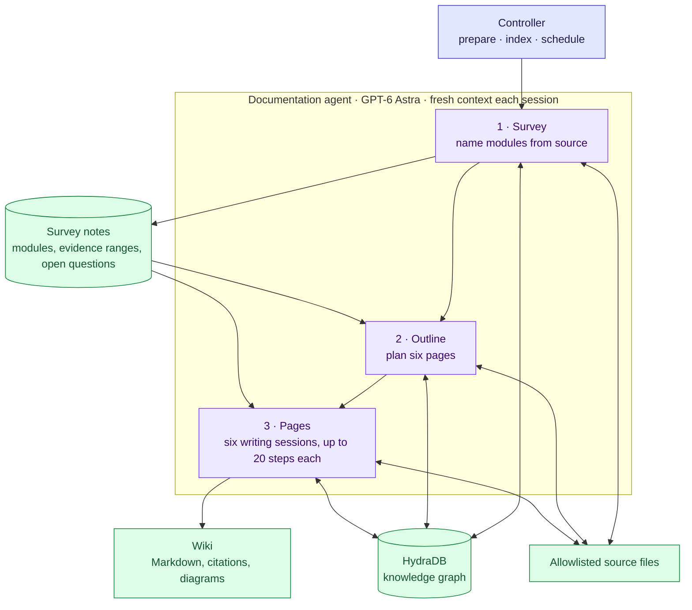
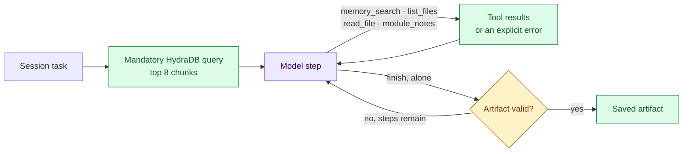
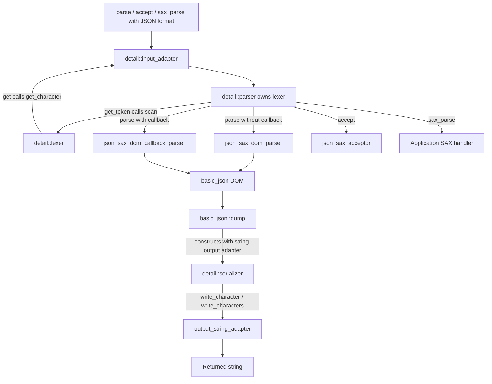

# Code Is a Graph: Repository Documentation with HydraDB on CodeWikiBench

*How a documentation agent built on HydraDB's graph-backed retrieval scored 90.7 on the nlohmann/json repository in CodeWikiBench, compared with 66.1 for DeepWiki and 61.3 for CodeWiki.*

---

## Abstract

A software repository is a network of files, modules, types and functions connected by calls, includes, inheritance and data flow. Most coding tools still explore it like a folder. They list directories, grep for strings and read one file at a time, then try to reconstruct the relationships in the model's context window. We built a documentation agent on a different premise. First, the repository is ingested into **HydraDB**, which turns the code into a queryable knowledge graph. Every step of the agent then starts from graph-aware retrieval instead of a blank directory listing.

We tested this *harness* on **CodeWikiBench** [1, 2], a benchmark of repository-level documentation. Each repository has a hierarchical rubric derived from the maintainers' own documentation, and a panel of three LLM judges scores every generated wiki. We followed the benchmark's methodology and compared **harness against harness**: the DeepWiki harness [3], the CodeWiki harness [1], and our HydraDB-backed harness. All three are scored on the same repository commit, rubric, judge models and scoring formula. On the C++ library **nlohmann/json**, our harness scores **90.73 ± 3.29 / 100**, and all three judges agree that **47 of 57** criteria are covered. The published results on the same rubric are **66.06** (33/57) for DeepWiki and **61.28** (30/57) for CodeWiki [1, Table 4].

---

## 1. Why a repository should be treated as a graph

Ask an engineer how `nlohmann::json` parses a string, and the answer crosses many files. `basic_json::parse` builds an input adapter and hands it to `parser`. The parser pulls tokens from `lexer` and emits events to a SAX handler, and `json_sax_dom_parser` turns those events back into a `basic_json` tree. No single file contains that explanation. It exists only in the **relationships** between files.

Coding tools approach those relationships in roughly three ways:

| Approach | How relationships are found | Limitation |
| --- | --- | --- |
| **File-system agents** | `ls`, `grep`, and reading files one at a time. The model infers connections in its own context. | Every connection must be rediscovered in every session, and the context window fills with raw file contents before any structure appears. |
| **Partial graphs** | A static AST or dependency graph is built once, then used to split the repository into modules. CodeWiki takes this approach [1]. | The graph shapes the plan but is not something the writing agent can query. It is computed once per run, with no retrieval over it and no memory across versions. |
| **Graph-backed memory (HydraDB)** | The repository is ingested into a persistent knowledge graph with relations between entities. Retrieval combines semantic, keyword and graph signals. | This is the approach tested here. |

HydraDB is built as a memory layer rather than a search index. Ingested content is organized around an ontology of entities and relations, and time is part of the data model, so knowledge can be versioned and reasoned about over time. Retrieval is hybrid: vector similarity, keyword matching and graph context work together, and the relations connected to a query can be forced into the ranking. For code, this means an agent can ask *"how does the parser hand values to the DOM builder?"* and get evidence ranked with the code's relationships taken into account, instead of a list of files that happen to contain the word "parser".

The question we wanted to answer is whether this makes a measurable difference on a real benchmark.

---

## 2. The experiment: a documentation harness built on HydraDB

We built a complete harness around HydraDB: a controller, an indexing layer, a tool-restricted documentation agent and an evaluation layer. The agent's task is to read a repository snapshot and write a multi-page technical wiki with source citations and architecture diagrams, similar to what DeepWiki or CodeWiki produce.

### 2.1 Agent architecture

The harness is a controller and one documentation agent. The controller prepares the snapshot, waits until HydraDB has indexed every eligible file, and then runs the agent through a fixed sequence of sessions. Session count, page count, and the start of evaluation are set by the controller. Inside a session, the agent's job is to produce that session's artifact.


```mermaid
flowchart TB
    CTRL["Controller<br/>prepare · index · schedule"]

    subgraph AGENT["Documentation agent · GPT-6 Astra · fresh context each session"]
        direction TB
        SURVEY["1 · Survey<br/>name modules from source"]
        OUTLINE["2 · Outline<br/>plan six pages"]
        PAGES["3 · Pages<br/>six writing sessions, up to 20 steps each"]
        SURVEY --> OUTLINE --> PAGES
    end

    NOTES[("Survey notes<br/>modules, evidence ranges, open questions")]
    HYDRA[("HydraDB<br/>knowledge graph")]
    FILES["Allowlisted source files"]
    WIKI["Wiki<br/>Markdown, citations, diagrams"]

    CTRL --> SURVEY
    SURVEY --> NOTES
    NOTES --> OUTLINE
    NOTES --> PAGES
    PAGES --> WIKI

    SURVEY <--> HYDRA
    OUTLINE <--> HYDRA
    PAGES <--> HYDRA
    SURVEY <--> FILES
    OUTLINE <--> FILES
    PAGES <--> FILES

    classDef control fill:#e0e7ff,stroke:#4338ca,color:#1e1b4b
    classDef model fill:#ede9fe,stroke:#7c3aed,color:#3b0764
    classDef storage fill:#dcfce7,stroke:#15803d,color:#14532d
    class CTRL control
    class SURVEY,OUTLINE,PAGES model
    class NOTES,HYDRA,FILES,WIKI storage
```

Each session starts with an empty message history. The survey note and the outline are the only state that later sessions inherit. The same model, the same tools, and the same step budget run the survey, the outline, and every page.

**Inside a session.** Before the model speaks, the controller sends the session task to HydraDB and places the top 8 chunks in the context. The model then loops. On each step it may call tools, or it ends the session by calling `finish` alone with the artifact (a JSON survey, a JSON outline, or one Markdown page). A response may batch up to 12 tool calls. `finish` cannot be mixed with other calls. The session allows 20 model steps and 15 minutes. On the last step the controller tells the model to finish from the evidence it already has.


```mermaid
flowchart LR
    TASK["Session task"] --> SEARCH["Mandatory HydraDB query<br/>top 8 chunks"]
    SEARCH --> MODEL["Model step"]
    MODEL -->|"memory_search · list_files<br/>read_file · module_notes"| TOOLS["Tool results<br/>or an explicit error"]
    TOOLS --> MODEL
    MODEL -->|"finish, alone"| CHECK{"Artifact valid?"}
    CHECK -->|"yes"| ART["Saved artifact"]
    CHECK -->|"no, steps remain"| MODEL

    classDef model fill:#ede9fe,stroke:#7c3aed,color:#3b0764
    classDef storage fill:#dcfce7,stroke:#15803d,color:#14532d
    classDef guard fill:#fef3c7,stroke:#b45309,color:#78350f
    class MODEL model
    class SEARCH,TOOLS,ART storage
    class CHECK guard
```

**Tools.** The agent has four ways to look at the repository, plus `finish`. It has no shell, no network, and no path that can leave the indexed allowlist.

| Tool | What it returns | Bound |
| --- | --- | --- |
| `memory_search` | HydraDB chunks for one natural-language question | 8 chunks; same query settings as §2.2 |
| `list_files` | Indexed paths containing a substring | 150 paths per call, paginated |
| `read_file` | Numbered source lines and the commit-pinned URL | 160 lines from one allowlisted file |
| `module_notes` | The saved survey: summary, named modules, evidence ranges, open questions | Available after the survey is saved |
| `finish` | The session artifact | Must be the only call in that response |

`read_file` is a lookup in the in-memory allowlist. A path outside that list, a bad line range, or any other tool error comes back as an error object in the same turn, and the model can try again. Survey evidence is checked before it is saved: every cited range must be lines `read_file` actually returned in that session, and each range is 1–20 lines. Dependency labels (`calls`, `uses`, `imports`, and so on) are stored as inferences from those reads. Later sessions are told to treat them as a reading list and to confirm behavior with HydraDB and `read_file` before writing it down.

**What each session produces.**

| Session | Input besides the mandatory search | Output |
| --- | --- | --- |
| Survey | Directory inventory of the allowlisted corpus | One note: summary, up to 6 named modules, evidence ranges, open questions |
| Outline | That note, via `module_notes` | JSON plan of at most 6 pages: slug, title, description |
| Page | The note, plus that page's title and description | One Markdown page, with commit-pinned source links and Mermaid where the code supports it |

Pages are written one after another. A finished page is checkpointed by content hash, so a resumed run reuses it. After the sixth page, the controller exports the wiki into CodeWikiBench's navigation format and hands it to the judge panel in §3. The judges are a separate system: they read the finished wiki through `docs_navigator` and never call the documentation agent's tools.

### 2.2 Stage by stage

**Prepare.** The controller downloads the benchmark record and passes only the repository URL and commit hash to the agent. It fetches that exact commit and applies a fixed input policy. For nlohmann/json, **263 files (3.6 MB)** are eligible: 205 test files, 46 library headers under `include/`, and build and tooling files. **911 files are excluded**, including all 564 documentation files. The agent never sees the maintainers' documentation or the rubric it will be graded against, so it has to learn the library from the code alone.

**Build the HydraDB graph.** Each eligible file is uploaded to a dedicated HydraDB collection for the run. Its source ID is derived from the repository, commit, path and content hash. HydraDB extracts entities and relations and builds the graph and embedding index on its own servers. The harness does not supply any parsing rules for C++. Generation starts only after every source reports `completed`, and this run reached 263 of 263.

**Retrieve through the graph.** Every agent query is sent to HydraDB's `/query` endpoint with these settings:

| Setting | Value | Effect |
| --- | --- | --- |
| `query_by` | `hybrid` | Combines semantic and keyword retrieval |
| `mode` | `thinking` | HydraDB's deeper retrieval mode |
| `graph_context` | `true` | Uses graph context in retrieval |
| `query_forceful_relations` | `true` | Forces relations connected to the query into consideration |
| `ids` | the run's allowlisted source IDs | Keeps retrieval inside this snapshot |
| `max_results` | 8 | Top 8 chunks per query |

HydraDB accepts at most 200 source IDs per request. With 263 files, each logical query is therefore sent as two requests with disjoint allowlists, and the results are merged by score. Results are filtered back to the allowlist and the run's collection. Identical queries are answered from a cache.

**Generate.** The controller then runs the agent in §2.1: one survey, one outline, and six page sessions, all on GPT-6 Astra through OpenRouter. Each session begins with the HydraDB query above.

**Evaluate.** The generated wiki is exported in CodeWikiBench's navigation format. It is then scored by the benchmark's judge code, pinned to the upstream commit [6], as described in §3.

### 2.3 What the run looked like

| Metric | Value |
| --- | ---: |
| Sources indexed in HydraDB | 263 / 263 |
| Logical HydraDB queries | 19 (8 mandatory, 11 requested by the agent) |
| HTTP search requests | 38 (two shards per query) |
| Evidence chunks delivered | 152 from 41 distinct files |
| Tool calls | 206 `read_file` · 11 `memory_search` · 8 `list_files` · 7 `module_notes` |
| Generator tokens | 1.47 M across 49 model calls |
| Wall time (survey to final page) | 19 min 47 s |
| Output | 6 pages · 8,445 words · 6 Mermaid diagrams |
| Source citations | 190 / 190 valid path and line ranges at the pinned commit |

Retrieval and file reading worked together. HydraDB returned relevant chunks from 41 files at the start of each session. The agent then spent its steps on targeted `read_file` calls to confirm exact lines before citing them.

---

## 3. The benchmark: CodeWikiBench

**CodeWikiBench** was introduced with the CodeWiki paper by FPT Software AI Center and the University of Melbourne [1]. It targets a gap that metrics like BLEU and ROUGE cannot fill: judging whether *repository-level* documentation actually covers how a system works.

**Dataset.** The public release [2] contains **22 open-source repositories** in seven languages: Python, Java, JavaScript, TypeScript, C, C++ and C#. Each record contains:

- the repository URL and the exact commit evaluated;
- `docs_tree` and `structured_docs`, the maintainers' official documentation parsed into a tree;
- `rubrics`, a hierarchical rubric derived from that documentation.

**Rubrics.** Rubric-generator agents built on Claude Sonnet 4, Gemini 2.5 Pro and Kimi K2 each drafted a rubric from the official documentation, and the drafts were merged into one [1, §3.1]. Each node has a requirement and a weight from 1 to 3. The nlohmann/json rubric has **8 top-level areas and 57 leaf criteria**:

| Area | Weight | Criteria |
| --- | ---: | ---: |
| Core JSON object model and type system | 3 | 7 |
| STL-compatible container interface | 3 | 7 |
| Serialization and deserialization engine | 3 | 13 |
| Type conversion and serialization framework | 3 | 9 |
| JSON Pointer and path navigation | 2 | 6 |
| JSON Patch and document modification | 2 | 5 |
| Exception handling and error management | 2 | 4 |
| Configuration and customization | 2 | 6 |

**Judges.** Three judge models from different model families score every leaf criterion: **Gemini 2.5 Flash** [7], **GPT-OSS 120B** [8] and **Kimi K2 Instruct** [9]. Each judge opens wiki pages with a `docs_navigator` tool and returns 1 if the criterion is explained, described or mentioned, and 0 otherwise, with reasoning and evidence.

**Scoring.** Every result in this post is written as a score and a spread, for example **90.73 ± 3.29**. The scoring method comes from the CodeWikiBench paper [1, §3.3].

*Step 1: score each criterion.* The three judges each vote 1 (documented) or 0 (not documented) on a leaf criterion. The leaf's score is the average of the votes, so a 1/1/0 vote scores 0.67. The spread \(\sigma\) is the standard deviation of the three votes. It measures how much the judges disagreed:

| Votes | Leaf score | \(\sigma\) | Meaning |
| --- | ---: | ---: | --- |
| 1 / 1 / 1 | 1.00 | 0.00 | All judges agree it is documented |
| 1 / 1 / 0 | 0.67 | 0.58 | Judges disagree |
| 1 / 0 / 0 | 0.33 | 0.58 | Judges disagree |
| 0 / 0 / 0 | 0.00 | 0.00 | All judges agree it is missing |

*Step 2: combine up the tree.* Every node above the leaves takes the **weighted average** of its children's scores. A child with weight 3 counts three times as much as a child with weight 1. The spreads are combined with the same weights:

\[
S(n)=\frac{\sum_i w(c_i)\,S(c_i)}{\sum_i w(c_i)},\qquad
\sigma_n=\frac{\sqrt{\sum_i w(c_i)^2\,\sigma_{c_i}^2}}{\sum_i w(c_i)}
\]

In these formulas, \(n\) is a node, \(c_i\) are its children, \(w(c_i)\) their weights, \(S(c_i)\) their scores and \(\sigma_{c_i}\) their spreads. The spread formula squares the weights and takes a square root. This is the standard way to combine independent uncertainties, so one disputed criterion doesn't dominate the total.

*Worked example.* In our run, the area "STL-compatible container interface" scored 75.0. It has three children:

| Child | Weight | Judge votes on its leaves | Child score |
| --- | ---: | --- | ---: |
| Element access (`at`, `operator[]`, `value`) | 3 | Every leaf 1 / 1 / 1 | 1.00 |
| Iterator system | 3 | Both leaves 1 / 1 / 0 | 0.67 |
| Container operations | 2 | `size`/`empty`/`clear` 0 / 0 / 0; `push_back`/`emplace`/`erase` 1 / 1 / 1 | 0.50 |

\[
S_{\text{area}}=\frac{3(1.00)+3(0.67)+2(0.50)}{3+3+2}=\frac{6}{8}=0.75
\]

The eight areas are then combined the same way into the final score of 0.9073, reported as 90.73.

*Reading the result.* In "90.73 ± 3.29":

- **90.73** is the weighted share of the rubric that the judges consider documented.
- **± 3.29** measures how much the judges disagreed on the way to that score. Lower means stronger agreement.

The spread is **not** a confidence interval. It doesn't estimate how much the score would change if the wiki were generated again.

The paper also reports **coverage**, the number of criteria that are satisfied. Here, a criterion counts as satisfied only when all three judges give it a 1.

---

## 4. Methodology: comparing harnesses

A documentation system is more than a model. It combines how the repository is represented, what the agent can retrieve, how work is planned and how pages are written. CodeWikiBench compares these complete systems, and so do we:

| | **DeepWiki** [3] | **CodeWiki** [1] | **Ours (HydraDB)** |
| --- | --- | --- | --- |
| Repository representation | Proprietary, closed source | Static AST dependency graph, used to split the repository into modules | HydraDB knowledge graph that the agent queries throughout the run |
| How the agent finds relationships | Not published | Follows the module tree built from the dependency graph; recursive sub-agents | Hybrid and graph-context retrieval at the start of every session and on demand |
| Agent structure | Not published | Recursive multi-agent system with delegation, bottom-up synthesis | One agent: survey, then outline, then 6 pages |
| Generator model | Proprietary | Kimi K2 Instruct (for json) | GPT-6 Astra |

**What is held constant.** All three systems are evaluated on the same pinned commit (`4bc4e37f`), the same 57-leaf rubric, the same three judge models, the same judge prompt, temperature 0 and the same hierarchical scoring code. Our judge setup reuses the upstream CodeWikiBench evaluator at a pinned commit [6]. It also adds stricter checks: a score is accepted only if the saved trace shows the judge actually read page content, and a failed judgment is never counted as a 0 or 1. All 171 judgments (3 judges × 57 criteria) were run from scratch on this wiki.

**What is not held constant.** The DeepWiki and CodeWiki scores are the published results from the paper's Table 4 [1]. We did not regenerate or re-score them. The generator models also differ between systems, as they do in the paper.

---

## 5. Results

### 5.1 Harness against harness on nlohmann/json

| Harness | Score / 100 | Criteria covered (all 3 judges) |
| --- | ---: | ---: |
| **HydraDB harness (ours)** | **90.73 ± 3.29** | **47 / 57** |
| DeepWiki | 66.06 ± 3.08 | 33 / 57 |
| CodeWiki (Kimi K2) | 61.28 ± 2.35 | 30 / 57 |

Our harness scores **+24.7 points** over DeepWiki and **+29.5 points** over CodeWiki, and covers 14 and 17 more criteria respectively. Judge disagreement (±3.29) is in the same range as the baselines, so the higher score does not come from one lenient judge.

This is also a hard repository for the other systems. The paper reports that C and C++ repositories are where both CodeWiki and DeepWiki struggle most [1, §5.2]. Across its main set, CodeWiki with Claude Sonnet 4 averages 53.24% on these languages and DeepWiki 56.39%. The cause the paper names is heavily cross-file, template-driven code, where the architecture lives in relationships between files rather than in any single file.

### 5.2 Scores by judge

| Judge | Score |
| --- | ---: |
| Gemini 2.5 Flash | 94.73 |
| GPT-OSS 120B | 93.72 |
| Kimi K2 | 83.74 |

Even the strictest judge, Kimi K2, scores our wiki 17.7 points above DeepWiki's panel average.

### 5.3 Scores by area

| Area | Panel | Gemini | GPT-OSS | Kimi |
| --- | ---: | ---: | ---: | ---: |
| Core object model and type system | **100.0** | 100 | 100 | 100 |
| Serialization engine (DOM, SAX, 5 binary formats) | **100.0** | 100 | 100 | 100 |
| Exception handling | **100.0** | 100 | 100 | 100 |
| JSON Patch and document modification | 95.2 | 100 | 85.7 | 100 |
| JSON Pointer and path navigation | 92.6 | 100 | 88.9 | 88.9 |
| Type conversion framework | 91.6 | 100 | 95.9 | 78.8 |
| STL-compatible container interface | 75.0 | 87.5 | 87.5 | 50.0 |
| Configuration and customization | 69.6 | 66.1 | 87.5 | 55.4 |

The three areas with perfect agreement all depend on connecting many files. Parsing runs from the input adapters through the lexer, parser and SAX handlers to the DOM. Serialization runs from `dump` through the output adapters and serializer, and on to the CBOR, MessagePack, BSON, UBJSON and BJData codecs. The type system runs from `basic_json`'s template parameters through `value_t` to the union storage. The weak spots are routine API details. For example, the `size`, `empty` and `clear` capacity functions were never explained, and C++20 three-way comparison and some low-weight configuration macros were not covered.

### 5.4 Improvement across our runs

We iterated on the harness over three runs, each scored by the same judge panel on the same rubric:

| Run | Change | Score | Judge σ | Covered |
| --- | --- | ---: | ---: | ---: |
| Pilot A | First complete wiki judged by the panel | 85.30 | 4.15 | 43 / 57 |
| Pilot B | Revised generator code and corpus manifest | 89.32 | 3.75 | 46 / 57 |
| **Current** | 20 model steps per page session (up from 10) | **90.73** | **3.29** | **47 / 57** |

All three runs score at least **19 points above both published baselines**. Each revision raised the score and lowered judge disagreement, while generation cost stayed at about 1.4 to 1.5 M tokens per wiki.

---

## 6. What the results do and don't show

- **The comparison is between complete systems, not a test of the graph alone.** The results show that a harness built on HydraDB retrieval produces much better documentation for this repository than the DeepWiki and CodeWiki harnesses. They do not isolate HydraDB's contribution from our generator model, which is newer than the paper's. In this run, all 152 retrieved chunks came back as HydraDB's graph-context ranked results, and none arrived through the separate graph-relations channel. The natural next experiment is the same harness and model with HydraDB replaced by a file-system-only toolset.
- **Temporal features were not exercised.** CodeWikiBench evaluates one pinned snapshot, so temporal reasoning was switched off (`temporal_reasoning: false`, `recency_bias: 0`). HydraDB's time-aware memory matters more for repositories that change over time, such as keeping documentation or agent context in sync across commits. A single snapshot doesn't test that.
- **The benchmark measures coverage.** Judges check whether each criterion is documented, not whether every sentence is correct. Our citation audit confirms that all 190 source links point to real lines at the pinned commit.
- **This is one repository and one run per configuration.** nlohmann/json is 1 of 22 CodeWikiBench repositories. The baselines come from the paper, and our judges run on current model hosting, which may not match the paper's setup exactly.

---

## 7. Conclusion

Repository understanding depends on relationships between files. The explanation of how a JSON string becomes a `basic_json` object lives in the connections between the lexer, parser, SAX handler and DOM builder, not in any one of those files. We built a documentation harness that starts from those connections. The repository is ingested into HydraDB as a knowledge graph. Every agent session begins with a hybrid, graph-context retrieval, and the agent confirms what it retrieves by reading the exact source lines it cites.

On CodeWikiBench's nlohmann/json repository, a C++ codebase of the kind the paper found hardest, this harness scored **90.73**, compared with **66.06** for DeepWiki and **61.28** for CodeWiki. All three judges agreed that it covers **47 of the 57** rubric criteria, against 33 and 30 for the baselines. The wiki cites 190 source lines, all valid at the pinned commit, and was written without the agent ever seeing the maintainers' documentation.

Next, we will run the full 22-repository suite, run a version of the same harness without HydraDB to measure the graph's contribution directly, and test repositories that change over time, where HydraDB's temporal memory can be exercised.

---

## 8. Future research

We will evaluate these harnesses on rubric coverage together with token use and cost. Coverage alone hides a system that spends far more generation to reach a similar wiki. This run used 1.47 M generator tokens for one repository. The same accounting will be kept for every later run: prompt and completion tokens, and the dollar cost of generation and judging.

---

## Reproducibility

All inputs, traces and scores are saved in `runs/codewiki-json-3/`:

- Generated wiki: [`json/wiki/pages/`](runs/codewiki-json-3/json/wiki/pages/)
- Judge panel result, manifest and per-judge scores: [`json/evaluation-paper-panel/`](runs/codewiki-json-3/json/evaluation-paper-panel/)
- HydraDB index manifest and retrieval cache: [`json/index-manifest.json`](runs/codewiki-json-3/json/index-manifest.json), [`json/retrieval-cache.json`](runs/codewiki-json-3/json/retrieval-cache.json)
- Harness design: [`docs/codewiki-agent-harness.md`](docs/codewiki-agent-harness.md), [`docs/codewikibench-pipeline.md`](docs/codewikibench-pipeline.md)

```sh
uv run python scripts/run_codewiki_paper_panel.py \
  --repos json --output runs/codewiki-json-3 \
  --agent-provider openrouter --agent-model openai/gpt-6-astra --plain
```

---

## References

[1] A. Nguyen Hoang, M. Le-Anh, B. Le, N. D. Q. Bui. *CodeWiki: Automated Repository-Level Documentation at Scale.* arXiv:2510.24428 (v1), 2025. The nlohmann/json baselines are in Table 4. [arxiv.org/abs/2510.24428v1](https://arxiv.org/abs/2510.24428v1)

[2] *CodeWikiBench* dataset, Hugging Face, revision `6d215eb7d50a164e370a9a5703b813f9da345965`. [huggingface.co/datasets/anhnh2002/codewikibench](https://huggingface.co/datasets/anhnh2002/codewikibench)

[3] Cognition. *DeepWiki.* [deepwiki.com](https://deepwiki.com/)

[4] G. Starace et al. *PaperBench: Evaluating AI's Ability to Replicate AI Research.* arXiv:2504.01848, 2025. Source of the rubric-based evaluation approach CodeWikiBench adopts. [arxiv.org/abs/2504.01848](https://arxiv.org/abs/2504.01848)

[5] HydraDB. Harness integration: [`src/hydra_agent/hydradb.py`](src/hydra_agent/hydradb.py), [`src/hydra_agent/codewiki_memory.py`](src/hydra_agent/codewiki_memory.py).

[6] FSoft-AI4Code. *CodeWikiBench* evaluator, commit `5e728fb40492effb54d59041f908dbf9079fe238`. [github.com/FSoft-AI4Code/CodeWikiBench](https://github.com/FSoft-AI4Code/CodeWikiBench)

[7] Google DeepMind. *Gemini 2.5.* arXiv:2507.06261, 2025. [arxiv.org/abs/2507.06261](https://arxiv.org/abs/2507.06261)

[8] OpenAI. *gpt-oss-120b & gpt-oss-20b Model Card.* arXiv:2508.10925, 2025. [arxiv.org/abs/2508.10925](https://arxiv.org/abs/2508.10925)

[9] Kimi Team. *Kimi K2: Open Agentic Intelligence.* arXiv:2507.20534, 2025. [arxiv.org/abs/2507.20534](https://arxiv.org/abs/2507.20534)

[10] N. Lohmann. *JSON for Modern C++.* [github.com/nlohmann/json](https://github.com/nlohmann/json)

---

## Appendix: Samples from the run

All samples below come unedited from `runs/codewiki-json-3/`, except that long fields are shortened (marked `…`).

### A. A rubric criterion

The rubric for the SAX parser, shown from the top-level area down to one leaf. Only the leaf is scored by the judges. The weights set how much each node counts toward its parent.

```json
{
  "requirements": "Serialization and Deserialization Engine", "weight": 3,
  "sub_tasks": [{
    "requirements": "JSON Text Processing Pipeline", "weight": 3,
    "sub_tasks": [{
      "requirements": "SAX Event-Driven Parser", "weight": 2,
      "sub_tasks": [{
        "requirements": "Low-level SAX parser (`sax_parse`) with event-based interface for memory-efficient processing of large files",
        "weight": 2
      }, …]
    }, …]
  }, …]
}
```

Source: `json/evaluation/rubrics.json`, leaf `2.0.1.0`. The generator never sees this file.

### B. HydraDB queries issued by the agent

Each session starts with a mandatory query containing the session's task. On top of those, the agent chose to issue these 11 `memory_search` queries. They show the agent using retrieval to locate relationships between files, not individual keywords:

1. *Where are the public basic_json parse and dump entry points and the parser and serializer implementation classes defined?*
2. *Where are basic_json JSON Pointer access, flatten, unflatten, patch, diff and merge_patch implemented, and how do they delegate to json_pointer?*
3. *How does tools/amalgamate/amalgamate.py resolve and recursively combine includes into the single header, and which functions implement this workflow?*
4. *Where does basic_json implement initializer-list construction, array and object factories, is_number inspection, get and get_to typed extraction, value defaults, items iteration, and push_back mutation?*
5. *Where does the text lexer read adapter characters, scan comments and tokens, and validate Unicode escapes and UTF-8 in lexer.hpp?*
6. *How do json_sax_dom_parser handle_value and parse_error build binary DOM values, and where are CBOR tag policies and UBJSON use_size/use_type implemented?*
7. *Where in binary_reader.hpp is cbor_tag_handler_t::store implemented and where in binary_writer.hpp does write_ubjson assert use_size for use_type?*
8. *Where does basic_json instantiate object_t array_t binary_t allocator and custom base, store diagnostic parent and position fields, and call JSONSerializer::to_json?*
9. *Where are the from_json_fn and to_json_fn ADL dispatch wrappers and JSON_USE_IMPLICIT_CONVERSIONS and JSON_DISABLE_ENUM_SERIALIZATION switches implemented?*
10. *Where is detail::json_base_class defined to select CustomBaseClass or json_default_base?*
11. *How does json_sax_dom_parser set start_position and end_position when JSON_DIAGNOSTIC_POSITIONS is enabled?*

Source: `json/generation-events.jsonl` (`retrieval_start` events).

### C. A HydraDB retrieval hit

The top hit returned to the outline session. Each hit is tied to a source ID, file path, commit and content hash, so the agent can cite it and then open the exact lines with `read_file`.

```json
{
  "source_id": "src_a724c12aa04d8e4fae4dc241f8086e5047efc668cf18e675866d883ebe53ccd0",
  "path": "include/nlohmann/json_fwd.hpp",
  "base_commit": "4bc4e37f4f56f88b3a80abb7a6508b19a244e803",
  "sha256": "8777a878c20a412dd04c8011c87c3d72d74e48a4dda5e52f7948e26dd2168931",
  "text": "… template<typename T, typename SFINAE = void> class JSONSerializer = adl_serializer,\n class BinaryType = std::vector<std::uint8_t>,\n class CustomBaseClass = void>\nclass basic_json;\n\n/// @brief JSON Pointer defines a string syntax …\ntemplate<typename RefStringType>\nclass json_pointer;\n\nusing json = basic_json<>;\n…\nusing ordered_json = basic_json<nlohmann::ordered_map>; …",
  "truncated": true,
  "score": 0.7237,
  "origin": "ranked"
}
```

One chunk connects the `basic_json` template parameters, `adl_serializer`, `json_pointer`, and the `json` and `ordered_json` aliases. Those four ideas correspond to rubric leaves 0.0.0, 0.0.1, 3.0.0.0 and 4.0.0, all of which the final wiki covers.

Source: `json/retrieval-cache.json`.

### D. A survey module note

The survey session saves a note that later sessions read through `module_notes`. The excerpt below shows its summary and one edge. Every edge's evidence has been checked against source lines the agent actually read. The relationship itself is recorded as inferred.

> **Summary:** This is nlohmann JSON, a header-based C++ library, not an application or compiler. Read include/nlohmann/json.hpp for basic_json and public parse/dump APIs; json_fwd.hpp defines json and ordered_json aliases and customization parameters. Verified flow: parse adapts input and invokes the parser; parser.hpp uses a lexer and SAX DOM handlers; dump constructs the output serializer. binary_reader.hpp dispatches BSON, CBOR, MessagePack, UBJSON and BJData input. Extension points include parser callbacks, SAX handlers, container/allocator template parameters and adl_serializer conversions. … CMake definitions and the generated json.hpp are absent from the indexed inventory, limiting build verification.

```json
{
  "path": "include/nlohmann/json.hpp",
  "symbol": "basic_json",
  "relation": "module",
  "question": "How do the public value API, parse/dump options and binary-format entry points fit together?",
  "evidence": [{
    "path": "include/nlohmann/json.hpp",
    "start_line": 4044, "end_line": 4055,
    "excerpt": "static basic_json parse(InputType&& i, parser_callback_t cb = nullptr, const bool allow_exceptions = true, const bool ignore_comments = false, const bool ignore_trailing_commas = false)\n{\n    basic_json result;\n    parser(detail::input_adapter(std::forward<InputType>(i)), …).parse(true, result);\n    return result;\n}",
    "validation": "source_location_and_read_checked; relationship semantics remain inferred"
  }]
}
```

Source: `json/wiki/exploration/state.json`.

### E. An excerpt from a generated wiki page

This excerpt is from the page *Text Parsing, SAX Processing and Serialization*. The diagram follows execution from the public API through the input adapter, parser, lexer and SAX handlers to the serializer. These components are spread across separate headers under `include/nlohmann/detail/`, and no single file contains the full path.

> The main text API parameters, in order, are:
>
> | API | Parameters after input | Result |
> |---|---|---|
> | `parse` | `cb=nullptr`, `allow_exceptions=true`, `ignore_comments=false`, `ignore_trailing_commas=false` | Constructed `basic_json` |
> | `accept` | `ignore_comments=false`, `ignore_trailing_commas=false` | Validation boolean |
> | `sax_parse` | handler pointer, `format=json`, `strict=true`, `ignore_comments=false`, `ignore_trailing_commas=false` | Handler/parser success boolean |
> | `dump` | `indent=-1`, `indent_char=' '`, `ensure_ascii=false`, `error_handler=strict` | Serialized `string_t` |


```mermaid
flowchart TD
    A[parse / accept / sax_parse with JSON format] --> B[detail::input_adapter]
    B --> C[detail::parser owns lexer]
    C -->|get_token calls scan| D[detail::lexer]
    D -->|get calls get_character| B
    C -->|parse without callback| E[json_sax_dom_parser]
    C -->|parse with callback| F[json_sax_dom_callback_parser]
    C -->|accept| G[json_sax_acceptor]
    C -->|sax_parse| H[Application SAX handler]
    E --> I[basic_json DOM]
    F --> I
    I --> J[basic_json::dump]
    J -->|constructs with string output adapter| K[detail::serializer]
    K -->|write_character / write_characters| L[output_string_adapter]
    L --> M[Returned string]
```

> `parser::sax_parse_internal()` uses a `std::vector<bool> states` to track whether each open container is an array or object. It checks keys, colons, separators and closing delimiters while issuing SAX calls such as `start_object`, `key`, `number_unsigned` and `end_array`. Text container sizes are reported as unknown. A handler returning `false` stops processing; syntax errors call its `parse_error` method. Floating-point overflow is also reported through this path as `out_of_range.406`. [Parser setup](https://github.com/nlohmann/json/blob/4bc4e37f4f56f88b3a80abb7a6508b19a244e803/include/nlohmann/detail/input/parser.hpp#L30-L189)

Every source link in the wiki points to a line range at the pinned commit. All 190 links were checked and are valid.

Source: `json/wiki/pages/text-io-and-sax.md`.

### F. Judge verdicts

Each judge returns a binary score with reasoning and evidence. A verdict is accepted only if the saved trace shows the judge read actual page content (`content_access.verified`).

**Covered: leaf 2.0.1.0, the SAX parser (Kimi K2, score 1)**

```json
{
  "score": 1,
  "reasoning": "The documentation extensively covers the `sax_parse` API with event-based interface. The page title explicitly mentions 'SAX Processing', and the content documents: (1) the `sax_parse` public API with its parameters, (2) the SAX handler interface with all required event methods (null, boolean, number_integer, …, parse_error), (3) custom SAX handler implementation examples, (4) contrast with DOM construction showing SAX avoids building a DOM, and (5) the fact that SAX handlers can abort parsing by returning false. …",
  "evidence": "… 'Four processing modes' section with '4. Custom SAX processing' subsection; Complete SAX interface documentation with json_sax<json> interface; StringCounter handler example …; Architecture diagram showing sax_parse routes to Application SAX handler separate from DOM construction",
  "model": "moonshotai/kimi-k2",
  "criterion": "2.0.1.0"
}
```

**Missed: leaf 1.2.0, capacity functions `size`, `empty` and `clear` (Kimi K2, score 0)**

```json
{
  "score": 0,
  "reasoning": "The documentation extensively covers the library's use of standard C++ containers (std::map, std::vector) as underlying storage and mentions various container operations like at(), find(), resize(), emplace(), push_back(), and erase(). However, there is no explicit documentation of the standard C++ container capacity and query functions: size(), empty(), and clear(). …",
  "evidence": "Searched all documentation pages for 'size', 'empty', 'clear' - no matches found. …",
  "model": "moonshotai/kimi-k2",
  "criterion": "1.2.0",
  "content_access": { "verified": true, "successful_paths": 16, "failed_paths": 0 }
}
```

**Split: leaf 3.2.3, serialization of derived types with inheritance (scores 1 / 0 / 0)**

| Judge | Score | Reasoning (shortened) |
| --- | :---: | --- |
| Gemini 2.5 Flash | 1 | "The documentation explicitly mentions and provides an example of using `CustomBaseClass` as an 'inheritance extension point' for `basic_json`." |
| GPT-OSS 120B | 0 | "It does not describe how derived C++ types are serialized or deserialized using that inheritance, nor does it provide examples or guidance for serializing objects that participate in an inheritance hierarchy." |
| Kimi K2 | 0 | "The only mention of 'inheritance' relates to the optional `CustomBaseClass` template parameter for `basic_json` itself, which the docs explicitly clarify is 'not automatic conversion of base-class members into JSON keys.'" |

The leaf scores 0.33. The wiki documented a related mechanism, but not the one the rubric asks about. The library's `NLOHMANN_DEFINE_DERIVED_TYPE_*` macros were not described. The stricter judges read the criterion more literally, which is why Kimi K2 has the lowest overall score (§5.2).

Source: `json/evaluation-paper-panel/judgments/<model>/<leaf>.json`.
